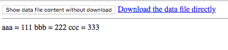

JavaScript JQuery Show Download File Content Demo
-------------------------------------------------

如何使用jquery来获取一个正常情况下是“下载”的文件的内容。

```
npm install
npm run demo
```

然后打开<http://localhost:3000>.


